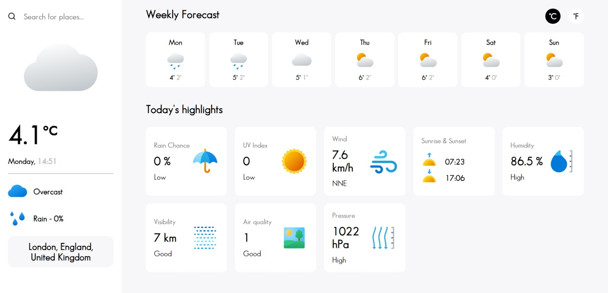

# Weather App Project

This is a **Weather App** built as part of [The Odin Project](https://www.theodinproject.com/) JavaScript curriculum. The project focuses on fetching weather data from an API and displaying it dynamically using JavaScript and DOM manipulation.

## Features

- **Fetch real-time weather data** from a weather API.
- **Search for cities** to get the current weather conditions.
- **Display key weather information**:
  - Temperature (°C/°F)
  - Weather condition (e.g., sunny, cloudy, rainy)
  - Humidity and wind speed
- **Toggle units** between Metric and US units.
- **Responsive design** for usability on both desktop and mobile screens.
- **Error handling** for invalid city searches.

## Project Preview



Try the live version of the project here: [Live Preview](https://gonalgar.github.io/weather-app/)

## Technologies Used

- **HTML5**: Markup for structuring the app.
- **CSS3**: Styling for a clean and modern UI.
- **JavaScript (ES6)**: Handles fetching and displaying weather data.
- **Webpack**: Bundles JavaScript modules for better performance.
- **Weather API**: Fetches real-time weather data.

## Getting Started

To view or modify the project locally:

1. Clone this repository:
   ```bash
   git clone https://github.com/gonalgar/weather-app.git
2. Navigate to the project directory:
   ```bash
    cd weather-app
3. Install the necessary dependencies:
   ```bash
    npm install
4. Add your API key from the VisualCrossing weather API in the JavaScript file.
5. Build the project using Webpack:
    ```bash
    npm run build
6. Open the index.html file in your browser to use the app.

## What I Learned
- Fetching data from an external API using fetch().
- Handling asynchronous JavaScript with async/await.
- Implementing error handling for API requests.
- Converting temperature units between Celsius and Fahrenheit.
- Using Webpack to bundle JavaScript modules.

## Acknowledgements
This project is part of [The Odin Project Intermediate JavaScript](https://www.theodinproject.com/paths/full-stack-javascript/courses/javascript) curriculum. It provided hands-on experience with API integration and data handling in web applications.

## License
This project is open-source and available under the MIT License.